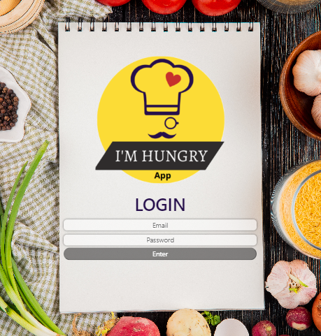
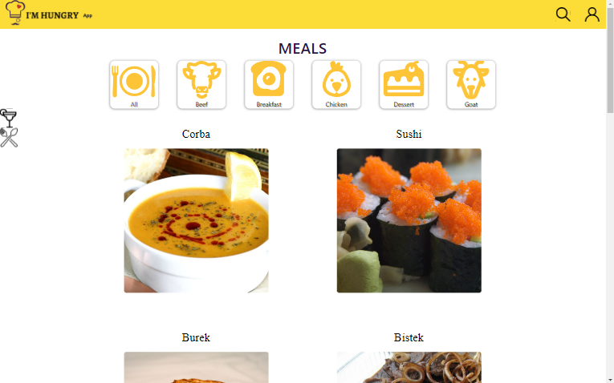
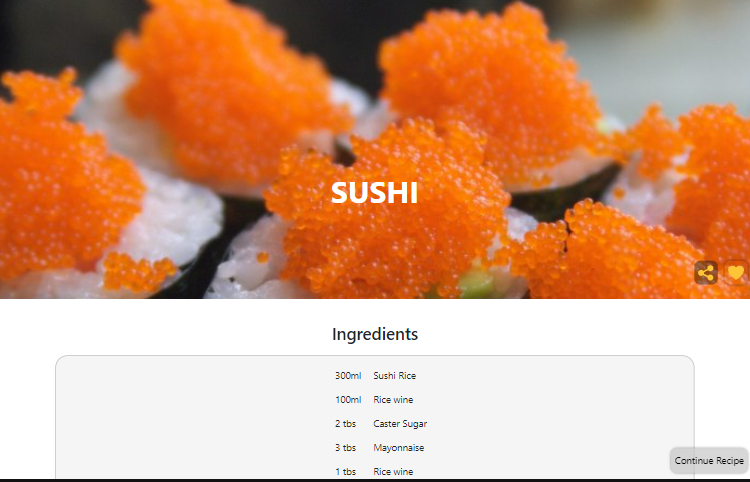

# I'm Hungry App: Seu parceiro na cozinha.

<a href='https://imhungryapp.vercel.app/'>imhungryapp.vercel.app</a>

Bem-vindo ao I'm Hungry App, Seu parceiro na cozinha que auxília a preparar suas refeições e drinks favoritos.

## Funcionalidades Principais
- Busque e salve suas receitas favoritas.
- Leia as instruções de preparação e ingredientes necessários.
- Prepare suas receitas.

## Tecnologias Utilizadas
- **Frontend:** React.js, Context Api, Bootstrap, CSS, SweetAlert, Jest;
- **APIs:** The Meal Db e The Cocktail Db

## Como Executar o Projeto:
  **Clone o Repositório:**
  
    git clone https://github.com/carlosleal89/recipes-app

  **Instale as Dependências:**

    npm install

## Via Docker
- Caso não tenha o Docker instalado em seu sistema, acesse https://www.docker.com/get-started/
  
  1. **Crie a imagem docker:**
     
         docker build -t im-hungry-app .
    
  2. **Execute o container:**
     
         docker run -p 3000:3000 --name hungry-app-container im-hungry-app
     
    - Acesse o aplicativo em seu navegador em http://localhost:3000.

## Executar Localmente

  ### Pré-requisitos
  - Node 16 ou 18 instalado em sua máquina   

   1. **Execute o projeto:**
      
          npm start
      
   2. Acesse o aplicativo em seu navegador em http://localhost:3000.

